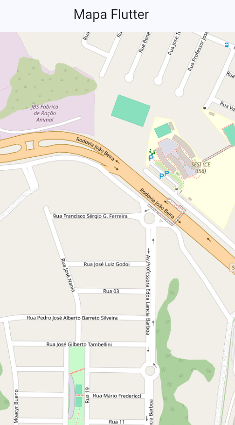

# 🗺️ Flutter Google Maps

Aplicação desenvolvida em **Flutter** utilizando o pacote `flutter_map` e o **OpenStreetMap** para criação de um mapa interativo.

O projeto permite que o usuário selecione um ponto no mapa, visualize um marcador no local selecionado e consulte as coordenadas de latitude e longitude.

---

## 📱 Funcionalidades

- 🗺️ Exibição de um mapa interativo
- 📍 Seleção de um ponto através de toque no mapa
- 📌 Exibição de marcador no ponto selecionado
- 🌎 Captura da latitude e longitude
- 💬 Exibição das coordenadas através de um `SnackBar`
- 🔍 Configuração de posição e zoom inicial
- 🎨 Interface utilizando Material 3

---

## 🛠️ Tecnologias utilizadas

- **Flutter**
- **Dart**
- **flutter_map**
- **latlong2**
- **OpenStreetMap**

---

## 📦 Dependências

As principais dependências utilizadas no projeto são:

```yaml
dependencies:
  flutter:
    sdk: flutter

  flutter_map: ^8.2.2
  latlong2: ^0.9.1

 ```

 --- 
 ## Print da Tela 
 

 ---

 ## Lívia Mazzolini Guarizo
